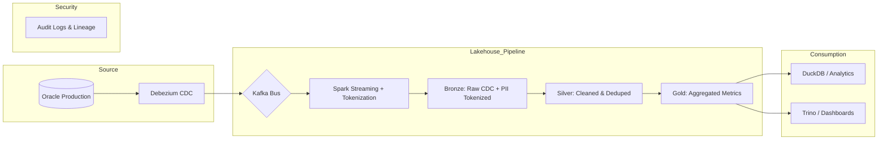

# Architecture Decision Record: Ride-Hailing Lakehouse (Decree 13 Compliant)

## 1. Problem Statement
Hệ thống này được thiết kế để giải quyết bài toán lưu trữ và phân tích dữ liệu cho một ứng dụng gọi xe tại Việt Nam với quy mô 100 triệu chuyến/năm và lưu lượng đỉnh điểm 30.000 writes/giây.

Các thách thức chính:
* Tuân thủ pháp lý: Dữ liệu chứa thông tin định danh cá nhân (PII) như số điện thoại, CMND, và tọa độ GPS thuộc phạm vi điều chỉnh nghiêm ngặt của Nghị định 13/2023/NĐ-CP.
* Hiệu năng: Hệ thống yêu cầu Dashboard cập nhật trong vòng 60 giây và các truy vấn ad-hoc phải đạt p95 < 1 giây.
* Dữ liệu đến muộn: Cần cơ chế xử lý các sự kiện từ những khu vực kết nối mạng không ổn định, dẫn đến tình trạng dữ liệu đến muộn thường xuyên.

## 2. Architecture Diagram

## 3. Các quyết định kiến trúc chính (Design Decisions)

| Quyết định | Lựa chọn đã chọn | Lựa chọn thay thế đã loại bỏ & Lý do |
| :--- | :--- | :--- |
| Table Format | Delta Lake | Loại bỏ Apache Iceberg: Delta Lake cung cấp tính năng Change Data Feed (CDF) tích hợp sâu với Spark, giúp xử lý các thay đổi CDC hiệu quả hơn và hỗ trợ tốt cho việc thực thi quyền xóa dữ liệu. |
| PII Strategy | Tokenization tại Bronze | Loại bỏ Encryption tại tầng cuối: Mã hóa làm chậm tốc độ truy vấn. Tokenization cho phép JOIN dữ liệu mà không cần giải mã, đảm bảo tuân thủ Nghị định 13 ngay từ tầng Bronze. |
| Ingestion | Debezium CDC | Loại bỏ Batch Export: Xuất dữ liệu theo lô không đáp ứng được SLA cập nhật trong 60 giây. Debezium truyền dữ liệu thời gian thực với tác động tối thiểu đến nguồn. |
| Late Data | MERGE với Timestamp | Loại bỏ Overwrite: Chỉ ghi đè đơn thuần sẽ khiến dữ liệu cũ đến muộn xóa mất dữ liệu mới hơn. Sử dụng logic MERGE để đảm bảo tính nhất quán. |
| Storage | S3 Intelligent Tiering | Loại bỏ S3 Standard: Với lưu lượng 10 TB/năm, chi phí sẽ tăng rất nhanh. Tiering giúp tự động chuyển dữ liệu cũ sang Archive để tối ưu FinOps. |

## 4. Failure Modes & Recovery (Kịch bản 3 giờ sáng)

1. Hỏng Schema (Schema Drift):
* Phát hiện: Schema Enforcement của Delta Lake sẽ chặn pipeline khi database nguồn thay đổi cấu trúc bảng.
* Xử lý: Sử dụng Schema Evolution tự động cho tầng Bronze để tránh mất dữ liệu, sau đó Architect sẽ review thủ công.

2. Yêu cầu xóa dữ liệu khẩn cấp (Quyền được quên):
* Phát hiện: Nhận yêu cầu pháp lý từ người dùng yêu cầu xóa thông tin cá nhân theo Nghị định 13.
* Xử lý: Tận dụng Deletion Vectors trong Delta Lake để thực hiện xóa dữ liệu nhanh chóng mà không cần ghi lại toàn bộ file lớn.

3. Dữ liệu CDC bị mất tín hiệu (Sequence Gap):
* Phát hiện: Kiểm tra sự sai lệch giữa các phiên bản commit trong transaction log.
* Xử lý: Sử dụng tính năng Time Travel để quay lại trạng thái dữ liệu ổn định gần nhất và đồng bộ lại từ offset trên Kafka.

## 5. Ước lượng chi phí (FinOps)

* Storage: Với khoảng 10 TB dữ liệu mỗi năm:
* S3 Standard: ~2.5 TB x $23/TB = $57.5/tháng.
* S3 Glacier: ~7.5 TB x $4/TB = $30/tháng.
* Compute: Sử dụng Spark Streaming (3 nodes m5.xlarge) ước tính khoảng $350/tháng.
* Tổng cộng: Chi phí ước tính dưới $500/tháng, nằm trong ngân sách cho phép.

## 6. Chiến lược MVP (1 tuần)

* Phạm vi: Xây dựng luồng xử lý CDC cho bảng chuyến xe (trips).
* Các bước thực hiện:
1. Thiết lập Debezium kết nối Oracle với Kafka.
2. Viết mã Spark Job để thực hiện Tokenize số điện thoại và ghi vào tầng Delta Bronze.
3. Triển khai lệnh MERGE để cập nhật trạng thái các chuyến xe theo thời gian thực.
4. Kiểm tra kết quả qua DuckDB trên tầng Gold.